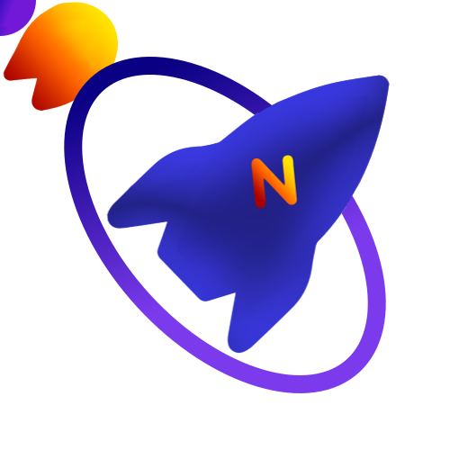

# Nykolas Farhangi
 
**Full-Stack & Cloud Engineer, ex-Google** ⚡ 
**B.S., Computer Science @ University of Houston** 🎓
 
I like to solve cool problems in interesting spaces. I'm a generalist who likes to own my products end-to-end, from user interface to service and data to deployment.
 
**Working with:** Go · TypeScript · Python · Java · Angular · React · Next.js · Node.js · GCP · AWS · Docker · GraphQL · Protobuf · PostgreSQL
 
- 🔭 Looking for work in the Los Angeles, CA and Seattle, WA areas
- 🌐 [nykolas.me](https://nykolas.me)

